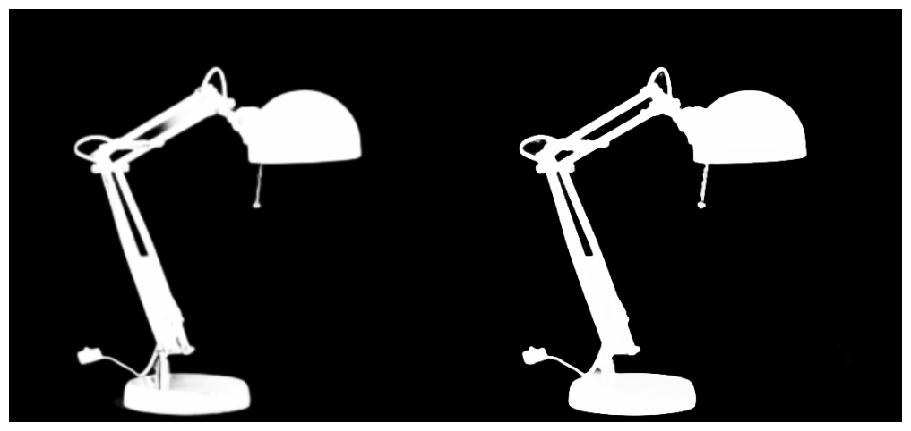

# SwinU2Matte: High-Resolution Image Matting with Hybrid Architecture

**SwinU2Matte** is a robust image matting and salient object detection model that combines the global context reasoning of **Swin Transformer** with the rich local detail extraction of **U^2-Net**.

Designed for high-resolution segmentation tasks (e.g., plant matting, portrait segmentation), it leverages a dual-encoder strategy to achieve precise edge detection and semantic consistency.

---
## 🌟 Key Features

* **Hybrid Encoder**: Fuses **Swin Transformer (Large)** features with **RSU (Residual U-blocks)** to balance global semantics and local details.
* **Strategic Fusion**: Injects Transformer features at the 96x96 resolution stage to guide the CNN encoder without losing high-frequency edge information.
* **Deep Supervision**: Utilizes multi-scale side outputs for robust training gradients.
* **Composite Loss**: Optimized using a combination of **BCE**, **IoU**, and **SSIM** losses for structural accuracy.
* **High-Res Support**: Capable of processing high-resolution images (e.g., 4K+) by lifting standard PIL limits.
* **Mixed Precision Training**: Implements AMP (Automatic Mixed Precision) for memory efficiency.

## 🛠️ Architecture

The model consists of two parallel branches:
1.  **Main Branch (CNN)**: A U^2-Net-based encoder-decoder structure using RSU blocks to maintain high-resolution details.
2.  **Auxiliary Branch (Transformer)**: A Swin-Large Transformer that extracts global context.

The features are fused at the **Stage 3 (96x96)** bottleneck, allowing the Transformer to act as a "global guide" for the U-Net's detail-oriented layers.

 *(Left: U^2-Net, Right: SwinU2Matte)*

## 📦 Installation

> 🐧 **Environment Note**: This project was developed and tested on **Ubuntu (Linux)**.

1.  **Clone the repository**
    ```bash
    git clone https://github.com/Jacky-0202/SwinU2Matte.git
    cd SwinU2Matte
    ```

2.  **Install dependencies**
    ```bash
    python3 -m venv .venv
    source .venv/bin/activate
    pip install -r requirements.txt
    ```
    *(Main requirements: `torch`, `torchvision`, `timm`, `opencv-python`, `Pillow`, `tqdm`, `matplotlib`)*

3.  **Download Pretrained Weights**
    Download the official Swin-Large weights (`swin_large_patch4_window12_384_22k.pth`) and place it in the `pretrained/` folder.
    ```bash
    mkdir pretrained
    # Place the .pth file inside
    ```

## 📂 Dataset Preparation

Organize your dataset as follows:

```text
data/
└── YourDatasetName/
    ├── images/
    │   ├── 001.jpg
    │   ├── 002.jpg
    │   └── ...
    └── masks/
        ├── 001.png  (Ground Truth, 0&255)
        ├── 002.png
        └── ...
```

## 🚀 Usage

### 1. Training

To train the model from scratch (or fine-tune):

```bash
python train.py
```

- **Checkpoints**: Saved in `checkpoints/run_TIMESTAMP/`.
- **Logs & Curves**: Training logs and loss/accuracy curves are saved in the same directory.
- **Settings**: Adjust `BATCH_SIZE`, `LR`, `DATA_ROOT`, and `EPOCHS` in `train.py`.

### 2. Inference (Testing)

To generate matte images (transparent background) from a folder of images:

1. Place your test images in `test_data/`.
2. Ensure your best model is located at `checkpoints/best_model.pth`.
3. Run:

```bash
python inference.py
```

Results (masks and transparent PNGs) will be saved in `results/test_prediction/`.

## 🤝 Acknowledgements

This project is built upon the excellent work of:

- **U^2-Net**: [U-2-Net: Going Deeper with Nested U-Structure for Salient Object Detection](https://github.com/xuebinqin/U-2-Net)
- **Swin Transformer**: [Swin Transformer: Hierarchical Vision Transformer using Shifted Windows](https://github.com/microsoft/Swin-Transformer)

